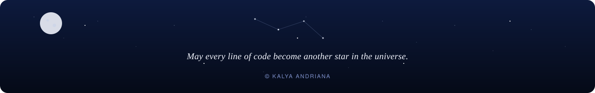

 

<i>
There is a particular kind of quiet that settles in after midnight —  
when the terminal is the only light left on, and the cursor blinks like something waiting to be told a secret. 
That is where most of what follows was built.
</i>

  

## &nbsp; About Me

I'm **Kalya Andriana**, an **Internet Engineering student at Universitas Gadjah Mada**, learning to break systems before others do and to build machines that *see*, *defend*, *sense* the world around them.

My work sits at the intersection of three constellations:

- **Artificial Intelligence & Computer Vision** — building systems that interpret what a camera sees the way a person would
- **Cybersecurity** — protecting the quiet infrastructure that everything else depends on
- **IoT** — connecting the physical world to something that can think about it

 

## &nbsp; Tech Constellation

 

**Languages**

  

**AI & Machine Learning**

  

**Cybersecurity**

  
  
  
  
  
  

**IoT**

  

**Tools & Platforms**

  

 

## &nbsp; Featured Projects

 

<table>
<tr>
<td width="50%" valign="top">

### Box Damage Detection
Computer vision system that identifies structural damage on shipping boxes before they leave the warehouse, catching what a tired human eye might miss on the thousandth package of the day.

**Stack:** `Python` `PyTorch` `OpenCV` `YOLO`

[→ View Repository](https://github.com/andkal06/Box-Damage-Detection)

</td>
<td width="50%" valign="top">

### Unsafe Behavior Detection
A YOLO-based vision system trained to spot unsafe behavior in real time — built for environments where a missed warning has real consequences.

**Stack:** `Python` `YOLO` `Computer Vision`

[→ View Repository](https://github.com/andkal06/Unsafe-Behavior-Detection-Using-Yolo-)

</td>
</tr>
<tr>
<td width="50%" valign="top">

### ECG Federated Learning
A federated learning pipeline for ECG classification that trains across distributed data without the data ever having to leave home — privacy and accuracy, held in balance.

**Stack:** `Python` `Jupyter Notebook` `Federated Learning`

[→ View Repository](https://github.com/andkal06/ECG-FEDERATED-LEARNING-)

</td>
<td width="50%" valign="top">

### COVID-19 Detection
A deep learning model trained on chest X-rays to assist in early COVID-19 screening — one of the earlier reminders that code can carry real weight.

**Stack:** `Python` `CNN` `Transformer` `Medical Imaging`

[→ View Repository](https://github.com/andkal06/COVID19-Detection-from-Chest-X-Ray-using-CNN-Transformer)

</td>
</tr>
<tr>
<td width="50%" valign="top">

### Face Expression Detection
A facial expression recognition system built on YOLO, evolved from an initial YOLOv8s baseline into a faster, more refined YOLOv11s version — both kept as a record of how the approach improved over time.

**Stack:** `Python` `YOLOv11s` `YOLOv8s` `Computer Vision`

[→ View Repository (YOLOv11s)](https://github.com/andkal06/Face-Expression-Detection-Using-YOLOV11S)
[→ Earlier version (YOLOv8s)](https://github.com/andkal06/Face-Expression-Detection-Using-Yolov8S)

</td>
<td width="50%" valign="top">

###  AI Fertilizer Recommendation
A machine learning model that recommends fertilizer type and dosage from soil and crop conditions — a small attempt at making agriculture a little more precise.

**Stack:** `Python` `Jupyter Notebook` `Machine Learning`

[→ View Repository](https://github.com/andkal06/AI-Fertilizer-Recommendation-model)

</td>
</tr>
<tr>
<td width="50%" valign="top">

###  CTF Write-Ups
A running collection of write-ups from Capture The Flag challenges — the trail left behind by every rabbit hole worth going down.

**Stack:** `Security` `CTF` `Write-ups`

[→ View Repository](https://github.com/andkal06/CTF-Write-Up-)

</td>
<td width="50%" valign="top">

### To-Do List (Python)
A clean, simple to-do list app — proof that not everything has to be complicated to be worth building well.

**Stack:** `Python` `HTML`

[→ View Repository](https://github.com/andkal06/To-Do-List-Python)

</td>
</tr>
</table>

 

## &nbsp; GitHub Universe

 

 

  

 

## &nbsp; Let's Connect

 

